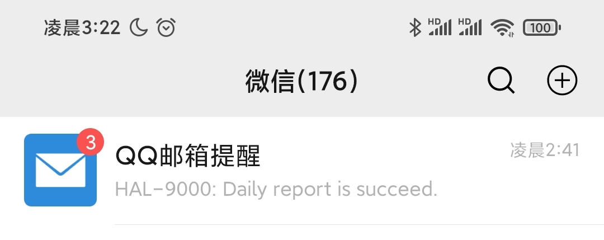

# XMU-Daily-Reporter

## Description 简介

This is a program for XMU students to report daily health which can notify you by smtp email  
这是一个厦门大学每日健康打卡系统的自动汇报程序，它可以通过smtp邮件服务通知你打卡的结果。

You can run it in linux or windows system.   
你可以在linux或windows系统上运行该程序。    

## Quick Start 快速开始

Download the executable file in github release page.   
从github的release界面下载程序。   

[Download address 下载地址](https://github.com/poor-circle/XMU-Daily-Reporter/releases)

Remember to choose right version for your system, We only supply ```x86-windows```/```x64-windows```/```x64-linux``` version now.          
记得选择合适的系统版本。目前我们只提供```x86-windows```/```x64-windows```/```x64-linux```这三个版本。  

unzip the file, edit setting in file ```report_setting.json```. The program will create a default setting file when it didn't find it.     
解压文件，在```report_setting.json```中编辑程序的设置。如果程序找不到它，会自动生成一个默认的配置文件。        

You need input your student ID, password in setting file. If you want to sent notify by email, add your email address and password.       
你需要在设置文件中填入你的学号，密码。如果你需要发送通知邮件，还需要填入你的邮箱账号和密码。


Here is a sample setting file：  
```jsonc
{
    "form_data": "blablaaaaaaaaa" ,  //Don't change it unless you know what are you doing
    "mail": {
        "address": "1000000@qq.com", //Your email address, if you dont want to send email, just set it to empty string like ""
        "reporter_name": "HAL-9000", //Your report robot name. It will show in email.
        "smtp_password": "123456"    //Your emails' smtp password, we will send email by smtp(port:587)
    },
    "report_retry": {
        "counts": 3,        //If report is failed, how many counts the program will retry.
        "duration": 10      //The duration(seconds) during each retry.
    },
    
    "user_agent": "Mozilla/5.0 (Windows NT 10.0; Win64; x64)", //Don't change it unless you know what are you doing.
    //Student's Info
    "xmu": {
        "ID": "23320779999999",//your XMU stuent ID
        "password": "123456"//your XMU login password 
    }
}
```
 
这是一个示例的设置文件：
```jsonc
{
    "form_data": "blablaaaaaaaaa" ,  //除非你知道你在干嘛，否则别管这个
    "mail": {
        "address": "1000000@qq.com", //填入你的邮箱地址，如果不想发送通知邮件，填入一个空字符串("")即可。 
        "reporter_name": "HAL-9000", //汇报机器人的名字，会在通知邮件中显示。
        "smtp_password": "123456"    //你的邮箱的smtp服务的密码（端口587）
    },
    "report_retry": {
        "counts": 3,                 //打卡失败时重试的次数
        "duration": 10               //打卡失败时每次重试间隔的秒数
    },
    "user_agent": "Mozilla/5.0 (Windows NT 10.0; Win64; x64)",  //除非你知道你在干嘛，否则别管这个
    //学生个人信息
    "xmu": {
        "ID": "23320779999999",      //你的学号
        "password": "123456"         //你的密码
    }
}
```

我们推荐使用QQ邮箱，因为它会在微信/QQ中弹出通知，符合国情。当然你也可以使用你自己喜欢的邮箱。这是[QQ邮箱设置SMTP服务的教程](https://www.jspxcms.com/documentation/351.html) 。注意，你获取的SMTP授权码就是需要填入的密码。

After Edit, you can run this program and it will report automatically. If you set your email address, It will also send an e-mail to your address.         
编辑完成以后，你可以运行该程序，程序会自动打卡。打卡成功后，如果你有设置邮件地址，那么程序会向你的邮箱发送邮件。

Here is a sample for the email.              
以下是邮件的示例（含成功和失败两种情况）     
            
           


## scheduled report and multi-user 定时汇报和多用户支持     

This program don't support scheduled report and multi-user. However it's easy to fix the program or use external script to support it.              
本程序不支持每天自动打卡，运行一次只能打一次卡，不支持多人打卡只支持一个人打卡。自己修改程序的后果我们概不负责。            
有些人会将在windows上将其设置为开机自启动，也有些人会在linux服务器上设置每日的定时任务来实现真正的全自动打卡。这些都和作者无关。                 

## security and duty 安全和责任说明

You shouldn't use this program to lie on your health. If you got a favor or travel to another location, please report it manually. No responsibility is accepted by the author.      
你不应该使用这个程序撒谎。本程序汇报的内容是可以通过```setting.json```中的```form_data```一项来修改的，本程序只不过默认你身体健康而已。如果你发烧或者移动到其他城市，请及时手动更新表单。      

Your personal info will save in local setting file. Please take care of it.          
你的个人信息将会明文保存在你的本地计算机，请小心照看它防止泄露。        

We use HTTPS/SSL and AES-128 to encrypt your personal info in communication, which is as same as the offical website. We will not sent it to another. You can read source code to confirm it.      
我们使用HTTPS和SSL证书以及额外的AES-128算法来加密传输你的信息，这和官方网站使用的加密方法是一致的。我们不会将你的个人信息发送给别人，你可以阅读源代码来确认这一点。           

## compile 编译

We use cmake to organize the project, use vcpkg to install third-party library, your c++ compiler should support C++17 standard.           
我们使用cmake来组织工程，使用[vcpkg包管理器](https://github.com/microsoft/vcpkg/blob/master/README_zh_CN.md)来安装第三方库，你的c++编译器需要支持C++17标准。     

Here is the step for compile：      
以下是编译的步骤         
0. 安装C++编译环境（Windows上安装Visual Studio，Linux上安装gcc/clang）
1. install vcpkg 安装vcpkg        
2. install third-party library by vcpkg 用vcpkg安装第三方库          
3. run cmake and compile 使用IDE，或者直接使用cmake编译本项目

许多IDE都支持CMAKE工程，如Visual Studio，CLION，安装好cmake插件的Visual Studio Code。

Here is the third-party library we use：  
你需要在vcpkg中安装这些库：
1. [spdlog](https://github.com/gabime/spdlog)
2. [mailio](https://github.com/karastojko/mailio)
3. [nlohmann-json](https://github.com/nlohmann/json)
4. [cpp-httplib](https://github.com/yhirose/cpp-httplib)
